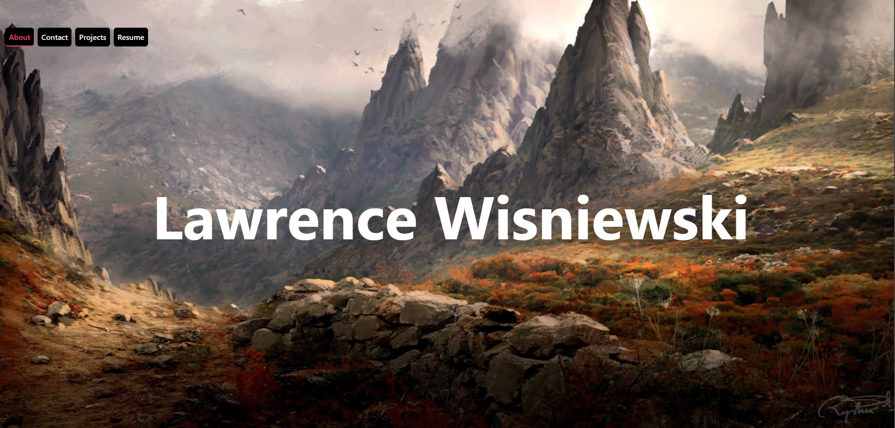

# React Portfolio

## Description

A simple portfolio built using typescript, vite, react, framer-motion, and tailwind.

## Installation

Clone the repository, open it up in your terminal. Run `npm i` to install the required dependencies. Run `npm run dev` to start the application in dev mode. Navigate to the url in the terminal that appears after running the dev command.

## Screenshot + Deployed Link

[Link to deployed webpage](https://lwportfolio.netlify.app/)

## License

N/A
